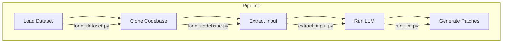

# SWE-Bench-Lite Pipeline

This project provides a pipeline to generate code diff patches for fixing issues in repositories from the SWE-Bench-Lite dataset using the LLM model. The pipeline consists of four main scripts:

1. **`load_dataset.py`**: Loads the SWE-Bench-Lite dataset and extracts relevant data.
2. **`load_codebase.py`**: Clones the repositories at the specified base commit.
3. **`extract_input.py`**: Extracts relevant code snippets for each issue.
4. **`run_llm_{model_name}.py`**: Generates code diff patches using the SWE-Llama-7b model.

---

## Flow Diagram



---

## Prerequisites

1. **Python 3.12**
2. **Git** (for cloning repositories)
3. **NVIDIA GPU** (for running the LLM model)

---

## Setup

1. Clone the repository:

   ```bash
   git clone https://github.com/KoYejune0302/bob-swe.git
   cd bob-swe
   ```

2. Create a virtual environment:

   ```bash
   python -m venv venv
   source venv/bin/activate
   ```

3. Install dependencies:
   ```bash
   pip install -r requirements.txt
   ```

---

## Usage

### 1. Load Dataset

Run the `load_dataset.py` script to load the SWE-Bench-Lite dataset and extract relevant data:

```bash
python load_dataset.py
```

This generates a JSON file (`swe_bench_lite_dev.json`) containing the extracted data.

---

### 2. Clone Codebase

Run the `load_codebase.py` script to clone the repositories at the specified base commit:

```bash
python load_codebase.py
```

The repositories are saved in the `codebase/{instance_id}` directory.

---

### 3. Extract Input

Run the `extract_input.py` script to extract relevant code snippets for each issue:

```bash
python extract_input.py
```

This generates input files (`input_data/{instance_id}/input.txt`) containing the problem statement and relevant code snippets.

---

### 4. Run LLM

Run the `run_llm_{model_name}.py` script to generate code diff patches using the SWE-Llama-7b model:

```bash
python run_llm_{model_name}.py
```

This generates a JSON file (`model_patches_YYYYMMDD_HHMMSS.json`) containing the patches.

---

### 5. Run test

```bash
pip install sb-cli
```

Before using the CLI, you'll need to get an API key:

1. Generate an API key:

```bash
sb-cli gen-api-key your.email@example.com
```

2. Set your API key as an environment variable - and store it somewhere safe!

```bash
export SWEBENCH_API_KEY=your_api_key
# or add export SWEBENCH_API_KEY=your_api_key to your .*rc file
```

3. You'll receive an email with a verification code. Verify your API key:

```bash
sb-cli verify-api-key YOUR_VERIFICATION_CODE
```

4. Submit the predictions to the SWE-Bench-Lite leaderboard:

```bash
sb-cli submit swe-bench_lite dev --predictions_path {model_patch.json} --run_id {run_id}
sb-cli submit swe-bench_lite test --predictions_path {model_patch.json} --run_id {run_id}
```

---

## Output

- **`swe_bench_lite_dev.json`**: Extracted dataset.
- **`codebase/{instance_id}`**: Cloned repositories.
- **`input_data/{instance_id}/input.txt`**: Extracted input for each issue.
- **`model_patches_YYYYMMDD_HHMMSS.json`**: Generated patches.

---

## Requirements

The `requirements.txt` file contains all the dependencies for the project. Install them using:

```bash
pip install -r requirements.txt
```

---

## Customization

- **Prompt Template**: Edit the `DEFAULT_PROMPT_TEMPLATE` in `prompt.py` to customize the prompt for the LLM.
- **Model**: Replace `princeton-nlp/SWE-Llama-7b` in `run_llm_swe_llama.py` with another model if needed.

---

## Troubleshooting

1. **Missing Dependencies**:

   - Ensure all dependencies are installed using `pip install -r requirements.txt`.
   - If you encounter missing libraries, install them manually (e.g., `pip install tiktoken`).

2. **GPU Issues**:
   - Ensure your GPU is available and recognized by PyTorch:
     ```bash
     python -c "import torch; print(torch.cuda.is_available())"
     ```
   - If this returns `False`, ensure CUDA is installed and compatible with your GPU.
